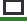

<h1 align="center">lernsax-themes</h1>

>Eine inoffizielle Bibliothek mit CCS- (und möglicherweise JS-) Dateien zur Verbesserung der Benutzeroberfläche von [LernSax.de](https://lernsax.de).  
>(einer Web- und Softwaresuite für die Kommunikation zwischen Bildungsinstitutionen, Lehrern und Schülern in Deutschland, Sachsen)

>A inofficial library of CCS (and maybe JS) files to mainly improve the UI/UX design of [LernSax.de](https://lernsax.de).  
>(a web- and softwaresuite for communication between educational institutions, teachers and students in Germany, Saxony)

----

<h3 align="center"><strong>Diese Bibliothek ist nur für die Webversion von LernSax erhältich.</strong></h3>
<h3 align="center"><strong>This library is only available for the web version of Lern Sax.</strong></h3>

----

## Themes

### Light Theme :sunny:

A theme for LernSax that keeps all the colors but changes how the UI is designed and how its responds to different screen-sizes.

### Dark Theme :crescent_moon:

[//]: # (Media Links:)

[LernSaxIcon]: ./lernsax_icon/lernsax_favicon_cut.bmp